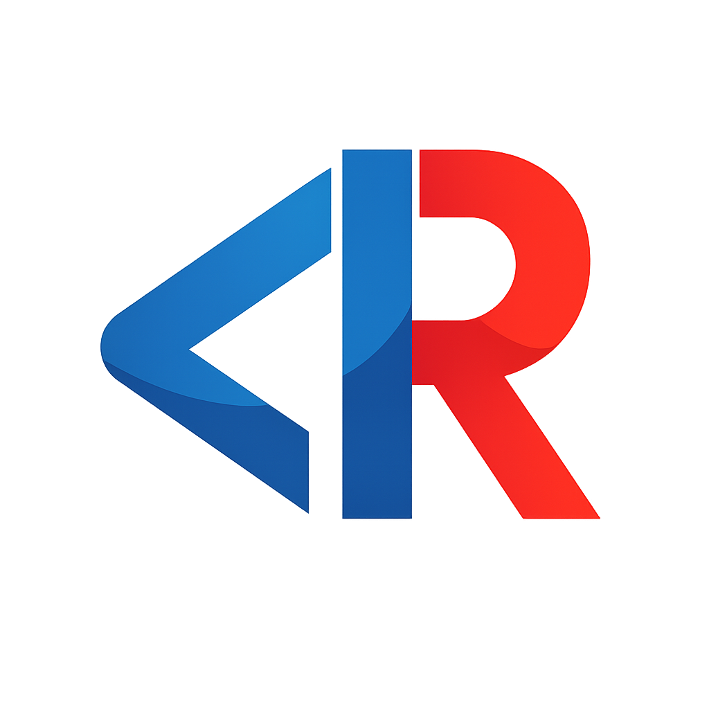
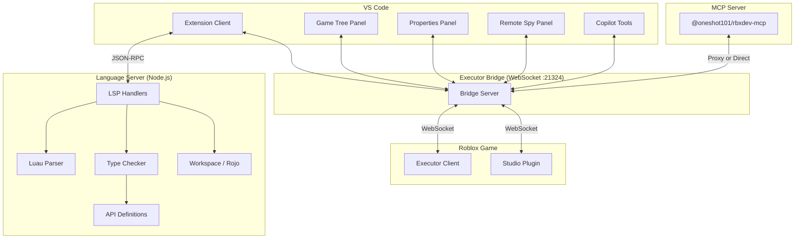

<div align="center">
  
  <h1>rbxdev-ls</h1>
  <p>Luau language server and VS Code extension for Roblox development with live-game tooling.</p>
  <p>
    <a href="https://marketplace.visualstudio.com/items?itemName=rbxdev.rbxdev-ls"></a>
    <a href="https://open-vsx.org/extension/rbxdev/rbxdev-ls"></a>
    <a href="https://www.npmjs.com/package/@oneshot101/rbxdev-mcp"></a>
    <a href="https://github.com/0neShot101/rbxdev-ls/blob/main/LICENSE"></a>
  </p>
</div>

---

## Overview

rbxdev-ls is a monorepo that ships a full-featured Luau language server, a VS Code extension, a standalone MCP server, and a Roblox Studio bridge plugin. The workspaces are **server** (parser, type checker, 30+ LSP handlers, and the executor bridge protocol), **vscode** (game tree explorer, properties panel, remote spy, and AI tool registration), **mcp** (the `@oneshot101/rbxdev-mcp` package for Claude, Cursor, Windsurf, and other MCP-compatible assistants), and **studio-plugin** (a Luau plugin built with Rojo that bridges Studio to the language server).

Most Luau editors offer syntax highlighting and maybe basic completions. rbxdev-ls goes further by loading the official Roblox API dump for type-aware completions and hover docs, running a real type checker that respects `--!strict` / `--!nonstrict` / `--!nocheck` annotations, and layering live-game tooling on top &mdash; you can browse the instance hierarchy, edit properties, execute code, and spy on remote calls without leaving your editor. The MCP server extends the same bridge to AI assistants so they can read game state and run code as part of a conversation.

## Features

- **Full Roblox API completions and hover docs** &mdash; loaded from the official API dump, including inherited members, deprecated tags, and documentation strings.
- **Luau type checking** &mdash; three strictness modes (`--!strict`, `--!nonstrict`, `--!nocheck`) with diagnostics surfaced inline in the editor.
- **30+ LSP handlers** &mdash; completion, hover, signature help, go-to-definition, find references, rename, document symbols, semantic tokens, code actions, formatting, inlay hints, call hierarchy, folding, selection range, type hierarchy, code lens, document links, color picker, and linked editing.
- **Rojo and sourcemap support** &mdash; resolves cross-file `require()` calls using `default.project.json` and `sourcemap.json` so go-to-definition and auto-import work across a Rojo project.
- **Game Tree explorer** &mdash; a sidebar panel that renders the live instance hierarchy from a connected Roblox game, with expand/collapse, property inspection, and context-menu actions.
- **Remote Spy** &mdash; captures RemoteEvent and RemoteFunction traffic in real time, with filtering, block lists, and quick-copy to reproduce calls.
- **In-editor code execution** &mdash; run the current file, a selection, or a bundled multi-file payload directly inside the game.
- **MCP server for AI assistants** &mdash; 19 tools (execute code, browse the game tree, read/write properties, manage instances, read console output, and more) exposed over the Model Context Protocol.
- **GitHub Copilot integration** &mdash; the same 19 tools are registered with VS Code's Language Model API so Copilot can interact with the game without a separate MCP client.
- **Instance manipulation** &mdash; create, clone, delete, reparent, and teleport to instances from the editor or through AI tools.

## Table of Contents

- [Quick Start](#quick-start)
- [How It Works](#how-it-works)
- [Architecture](#architecture)
- [Installation](#installation)
- [Usage](#usage)
- [Executor Bridge Setup](#executor-bridge-setup)
- [MCP Server](#mcp-server)
- [Configuration](#configuration)
- [Keyboard Shortcuts](#keyboard-shortcuts)
- [Project Structure](#project-structure)
- [Development](#development)
- [Contributing](#contributing)
- [License](#license)

## Quick Start

Install the extension from the [VS Code Marketplace](https://marketplace.visualstudio.com/items?itemName=rbxdev.rbxdev-ls) or [Open VSX](https://open-vsx.org/extension/rbxdev/rbxdev-ls), open a folder containing `.lua` or `.luau` files, and start coding. The language server activates automatically and provides completions, type checking, and hover docs with no additional setup.

```lua
--!strict

local Players = game:GetService("Players")
local localPlayer = Players.LocalPlayer
local character = localPlayer.Character or localPlayer.CharacterAdded:Wait()
```

Type checking, completions, and hover documentation appear immediately. For live-game features (game tree, remote spy, code execution), see [Executor Bridge Setup](#executor-bridge-setup).

## How It Works

When VS Code activates the extension, it spawns the language server as a Node.js child process communicating over JSON-RPC (the standard LSP transport). The server parses every open `.lua` and `.luau` file into an AST, runs a type checker against the Roblox API dump and any workspace definitions, and responds to editor requests through 30+ registered LSP handlers. Rojo project files and `sourcemap.json` are read at startup and watched for changes so that cross-file `require()` resolution stays current without manual reloads.

Live-game features use a separate WebSocket channel. The extension starts a WebSocket server on port 21324 (configurable) and waits for an executor bridge client to connect from inside a running Roblox game. Once connected, the extension can send commands (execute code, request the instance tree, read properties) and receive events (game tree snapshots, remote spy captures, runtime errors, console logs). The MCP server can either own this WebSocket server directly or connect as a proxy client through the extension's bridge when both are running simultaneously.

| Component                      | Transport                      | Direction                                 |
| ------------------------------ | ------------------------------ | ----------------------------------------- |
| Editor &harr; Language Server  | JSON-RPC over stdio            | Bidirectional                             |
| Extension &harr; Executor      | WebSocket on port 21324        | Bidirectional                             |
| MCP Client &harr; MCP Server   | stdio (Model Context Protocol) | Bidirectional                             |
| MCP Server &harr; Extension    | WebSocket proxy                | Bidirectional (when extension is running) |
| Studio Plugin &harr; Extension | WebSocket on port 21324        | Bidirectional                             |

## Architecture



## Installation

The simplest path is installing the pre-built extension from a marketplace. For contributors who want to build from source, see [Development](#development).

### VS Code Extension

Install from either marketplace:

| Marketplace         | Link                                                                                     |
| ------------------- | ---------------------------------------------------------------------------------------- |
| VS Code Marketplace | [rbxdev.rbxdev-ls](https://marketplace.visualstudio.com/items?itemName=rbxdev.rbxdev-ls) |
| Open VSX            | [rbxdev/rbxdev-ls](https://open-vsx.org/extension/rbxdev/rbxdev-ls)                      |

Alternatively, search for `rbxdev-ls` in the VS Code extensions panel and install directly.

### MCP Server (Standalone)

If you want AI assistants to interact with Roblox games without VS Code, install the MCP server globally or run it via npx. See [MCP Server](#mcp-server) for full setup instructions.

## Usage

### Language Server

The language server activates automatically for any workspace containing `.lua` or `.luau` files. It provides the full range of editor features without any configuration:

- Type `game:GetService("` to see a completion list of all Roblox services.
- Hover over any Roblox API member to see its type signature and documentation.
- Use `Ctrl+Click` (or `F12`) to jump to the definition of a local variable, function, or required module.
- Rename a symbol with `F2` and all references update across the workspace.
- Type errors appear as diagnostics in the Problems panel, respecting the `--!strict` / `--!nonstrict` / `--!nocheck` annotation at the top of each file.

### Live-Game Features

After connecting an executor bridge (see [Executor Bridge Setup](#executor-bridge-setup)), the sidebar panels become active:

- **Game Tree** &mdash; expand services and instances to browse the hierarchy. Right-click for actions like teleport, clone, delete, or copy the Luau path.
- **Properties** &mdash; select an instance in the game tree to view and edit its properties. Supports all standard Roblox types (Vector3, CFrame, Color3, UDim2, and more).
- **Remote Spy** &mdash; toggle the spy to capture all RemoteEvent and RemoteFunction traffic. Filter by name, set up block lists, and copy calls as runnable Luau code.

### Code Execution

Three execution modes are available through keyboard shortcuts or the command palette:

| Mode               | Shortcut           | Behavior                                                                |
| ------------------ | ------------------ | ----------------------------------------------------------------------- |
| Execute file       | `Ctrl+Shift+E`     | Sends the entire active file to the executor                            |
| Execute selection  | `Ctrl+Shift+Alt+E` | Sends only the selected text                                            |
| Bundle and execute | `Ctrl+Alt+E`       | Resolves `require()` calls, bundles into a single payload, and executes |

Runtime errors and `print`/`warn`/`error` output appear in the VS Code output channel.

## Executor Bridge Setup

The executor bridge is a Luau script that runs inside a Roblox game and opens a WebSocket connection back to the language server. To enable live-game features, paste this into your executor's auto-execute:

```lua
loadstring(game:HttpGetAsync('https://raw.githubusercontent.com/0neShot101/rbxdev-ls/main/scripts/executor-bridge.lua'))()
```

The bridge connects to `ws://127.0.0.1:21324` by default. If you need to customize the connection, pass a config table:

```lua
loadstring(game:HttpGetAsync('https://raw.githubusercontent.com/0neShot101/rbxdev-ls/main/scripts/executor-bridge.lua'))({
    host = 'ws://127.0.0.1:21324';
    reconnectDelay = 5;
    firstConnectDepth = 999;
    updateTreeDepth = 2;
    expandedTreeDepth = 2;
})
```

| Parameter           | Default                | Purpose                                                            |
| ------------------- | ---------------------- | ------------------------------------------------------------------ |
| `host`              | `ws://127.0.0.1:21324` | WebSocket URL the bridge connects to                               |
| `reconnectDelay`    | `5`                    | Seconds between reconnection attempts after a disconnect           |
| `firstConnectDepth` | `999`                  | How many levels deep to scan the instance tree on first connection |
| `updateTreeDepth`   | `2`                    | Depth of tree updates sent when instances change                   |
| `expandedTreeDepth` | `2`                    | Depth of subtree sent when expanding a node in the game tree panel |

## MCP Server

The `@oneshot101/rbxdev-mcp` package exposes 19 tools over the Model Context Protocol, letting Claude, Cursor, Windsurf, and other MCP-compatible AI assistants interact with a live Roblox game. It requires Node.js 18+ and a running executor bridge connection.

### Setup

The package is published to the public npm registry under the `@oneshot101` scope.

Then add this block to your MCP client configuration:

```json
{
  "mcpServers": {
    "rbxdev-roblox": {
      "command": "npx",
      "args": ["-y", "@oneshot101/rbxdev-mcp"]
    }
  }
}
```

The config file location depends on your tool:

| Tool           | Config location                      |
| -------------- | ------------------------------------ |
| Claude Code    | `~/.claude/mcp_config.json`          |
| Claude Desktop | Settings &rarr; MCP Servers          |
| Cursor         | `.cursor/mcp.json` in your project   |
| Windsurf       | Cascade &rarr; MCP &rarr; Add Server |

### Proxy Mode

If the rbxdev-ls VS Code extension is already running (it owns the WebSocket server on port 21324), the MCP server automatically connects as a proxy client through the extension's bridge. Both tools share the same executor connection with no port conflicts. If the extension is not running, the MCP server starts its own WebSocket server and connects to the executor directly.

### Custom Port

To use a non-default port, set the `RBXDEV_BRIDGE_PORT` environment variable:

```json
{
  "mcpServers": {
    "rbxdev-roblox": {
      "command": "npx",
      "args": ["-y", "@oneshot101/rbxdev-mcp"],
      "env": {
        "RBXDEV_BRIDGE_PORT": "21325"
      }
    }
  }
}
```

<details>
<summary><strong>Available MCP Tools</strong></summary>

| Tool                     | Description                                                             |
| ------------------------ | ----------------------------------------------------------------------- |
| `get_bridge_status`      | Check whether the bridge is running and an executor is connected        |
| `execute_code`           | Run Luau code in the game with full Roblox API access                   |
| `get_game_tree`          | Browse the game hierarchy (services, instances, children)               |
| `get_properties`         | Read property values from any instance                                  |
| `set_property`           | Set properties on instances (supports Vector3, Color3, UDim2, and more) |
| `get_children`           | List children of a specific instance                                    |
| `create_instance`        | Create new instances in the game                                        |
| `clone_instance`         | Clone existing instances                                                |
| `delete_instance`        | Remove instances from the game                                          |
| `reparent_instance`      | Move instances to a new parent                                          |
| `teleport_player`        | Teleport the local player to an instance's position                     |
| `get_script_source`      | Decompile and read script source code                                   |
| `get_console_output`     | Read recent print/warn/error output from the game                       |
| `refresh_game_tree`      | Request a fresh snapshot of the game tree                               |
| `get_remote_calls`       | View captured RemoteEvent/RemoteFunction calls                          |
| `set_remote_spy_enabled` | Toggle the remote spy on or off                                         |
| `set_remote_spy_block_list` | Block selected remotes from firing to the server                    |
| `set_script_source`      | Update script source when connected through Studio                      |
| `save_instance`          | Save the game or a specific instance to a file                          |

The server also exposes three MCP resources for passive reading:

| Resource URI             | Content                         |
| ------------------------ | ------------------------------- |
| `rbxdev://bridge/status` | Connection status as JSON       |
| `rbxdev://game/tree`     | Full game tree rendered as text |
| `rbxdev://console/logs`  | Recent console output           |

</details>

## Configuration

All settings are prefixed with `rbxdev-ls.` and can be set in VS Code's `settings.json` or through the Settings UI.

| Setting                         | Default     | Purpose                                                                                                                                    |
| ------------------------------- | ----------- | ------------------------------------------------------------------------------------------------------------------------------------------ |
| `rbxdev-ls.typeCheckMode`       | `nonstrict` | Controls the default type checking strictness for files without a `--!` annotation at the top. Accepts `strict`, `nonstrict`, or `nocheck` |
| `rbxdev-ls.enableSuncApi`       | `false`     | Loads Sunc executor API definitions into the type environment, providing completions and type checking for Sunc-specific globals           |
| `rbxdev-ls.executorBridge.port` | `21324`     | The TCP port the WebSocket bridge server listens on for executor and Studio plugin connections                                             |
| `rbxdev-ls.mcp.enabled`         | `true`      | Enables the built-in MCP server integration that registers language model tools with VS Code's Copilot API                                 |
| `rbxdev-ls.bundler.path`        | `""`        | Path to a custom `luau-bundle` binary used for the bundle-and-execute command. When empty, the built-in bundler is used                    |
| `rbxdev-ls.debugLogs`           | `false`     | Enables verbose logging in the extension output channel for troubleshooting connection and protocol issues                                 |

## Keyboard Shortcuts

| Shortcut           | Command                                                        |
| ------------------ | -------------------------------------------------------------- |
| `Ctrl+Shift+E`     | Execute the current file in-game                               |
| `Ctrl+Shift+Alt+E` | Execute the selected text in-game                              |
| `Ctrl+Alt+E`       | Bundle all required modules and execute                        |
| `Ctrl+Shift+R`     | Copy the last Remote Spy call to clipboard                     |
| `Ctrl+Shift+Alt+R` | Insert the last Remote Spy call at the cursor                  |
| `Ctrl+Alt+C`       | Quick copy (copies the last Remote Spy call as a Luau snippet) |

## Project Structure

```
rbxdev-ls/
├── packages/
│   ├── server/                    Language server package (rbxdev-server)
│   │   ├── src/
│   │   │   ├── core/              LSP server bootstrap, connection, and capability registration
│   │   │   ├── lsp/
│   │   │   │   └── handlers/      30+ LSP request handlers (completion, hover, rename, etc.)
│   │   │   ├── parser/            Luau lexer, parser, and doc-comment extraction
│   │   │   ├── typings/           Type system, type checker, and subtyping logic
│   │   │   ├── definitions/       Roblox API, stdlib, executor, and third-party type definitions
│   │   │   ├── workspace/         Module resolution, Rojo integration, and sourcemap support
│   │   │   ├── executor/          Bridge protocol, WebSocket server, and proxy handling
│   │   │   └── utils/             Shared utility functions
│   │   ├── tests/                 29 test suites (984 tests)
│   │   └── data/                  Roblox API dump (roblox-api.json)
│   ├── vscode/                    VS Code extension client
│   │   └── src/
│   │       ├── extension.ts       Extension activation and command registration
│   │       ├── gameTreeProvider.ts Game tree sidebar data provider
│   │       ├── propertiesProvider.ts Properties panel data provider
│   │       ├── remoteSpyWebview.ts Remote spy webview panel
│   │       └── mcpTools.ts        19 language model tools for Copilot integration
│   ├── mcp/                       Standalone MCP server (@oneshot101/rbxdev-mcp)
│   │   └── src/
│   │       ├── index.ts           Entry point (stdio transport)
│   │       └── server.ts          Tool and resource registration
│   └── studio-plugin/             Roblox Studio bridge plugin (Luau, built with Rojo)
│       ├── default.project.json   Rojo project file
│       └── src/                   Plugin source
├── scripts/                       Build orchestration and maintenance
│   ├── build-vsix.ts              Packages the VS Code extension as a .vsix
│   ├── build-studio-plugin.ts     Builds the Studio plugin via Rojo
│   ├── fetch-roblox-api.ts        Downloads the latest Roblox API dump
│   └── executor-bridge.lua        Bridge script loaded by executors at runtime
└── package.json                   Workspace root (bun workspaces)
```

## Development

### Prerequisites

| Dependency | Minimum Version | Install                                     |
| ---------- | --------------- | ------------------------------------------- |
| Bun        | &ge; 1.0.0      | `curl -fsSL https://bun.sh/install \| bash` |
| Node.js    | &ge; 18         | Required for MCP package builds and runtime |
| Rojo       | Latest          | Only needed for `build:studio` (optional)   |

### Setup

```bash
git clone https://github.com/0neShot101/rbxdev-ls && cd rbxdev-ls
bun install
```

All dependencies across every workspace are installed by the single `bun install` at the repo root.

### Scripts

| Script                 | Description                                                                                |
| ---------------------- | ------------------------------------------------------------------------------------------ |
| `bun run build`        | Build the language server (compiles `packages/server` with Bun targeting Node.js)          |
| `bun run build:mcp`    | Build the standalone MCP server                                                            |
| `bun run build:all`    | Build the language server and MCP server in sequence                                       |
| `bun run test`         | Run the full test suite (984 tests across 29 files)                                        |
| `bun run type-check`   | Run the TypeScript compiler in check-only mode against the server package                  |
| `bun run lint:check`   | Run ESLint without auto-fixing                                                             |
| `bun run lint`         | Run ESLint with auto-fix                                                                   |
| `bun run format:check` | Check formatting with Prettier                                                             |
| `bun run format`       | Auto-format with Prettier                                                                  |
| `bun run fetch-api`    | Download the latest Roblox API dump and write it to `packages/server/data/roblox-api.json` |
| `bun run build:vsix`   | Package the VS Code extension as a `.vsix` file for distribution                           |
| `bun run build:beta`   | Package a beta build of the extension                                                      |
| `bun run build:studio` | Build the Roblox Studio plugin using Rojo                                                  |

### Verify

After cloning and installing, confirm everything works:

```bash
bun run build && bun run test
```

All 984 tests should pass. If they do, the language server binary is at `packages/server/dist/index.js` and ready for the extension to consume.

## Contributing

Issues and pull requests are welcome. If you are adding new behavior or changing existing behavior, include tests in the relevant `packages/server/tests/` suite. Bug reports should include the Luau snippet that reproduces the issue and the expected versus actual behavior.

To submit a pull request, fork the repository, create a branch, and open a PR against `main`. The CI pipeline runs type checking, linting, formatting, and the full test suite on every push.

## License

[MIT](./LICENSE) &copy; 2025 Andrew
