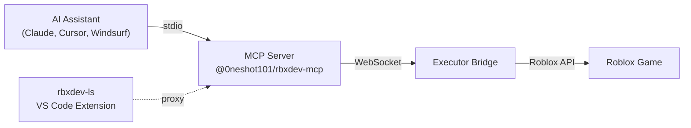

<div align="center">


<h1>@0neshot101/rbxdev-mcp</h1>

<p>MCP server that connects AI assistants to live Roblox game instances over a local WebSocket bridge</p>

<p>
  <a href="https://github.com/0neShot101/rbxdev-ls/packages"></a>
  = 18">
  
  <a href="https://github.com/0neShot101/rbxdev-ls/blob/main/LICENSE"></a>
</p>

</div>

---

## Overview

`@0neshot101/rbxdev-mcp` is a [Model Context Protocol](https://modelcontextprotocol.io) server that gives AI assistants &mdash; Claude, Cursor, Windsurf, and any other MCP-compatible tool &mdash; direct access to a running Roblox game. It exposes 16 tools and 3 resources that let an AI browse the game hierarchy, read and write instance properties, execute Luau code, inspect scripts, monitor remote calls, and manipulate the scene graph, all in real time.

The server is part of the [rbxdev-ls](https://github.com/0neShot101/rbxdev-ls) monorepo and depends on `rbxdev-server` (the shared language server core) for its bridge layer. It communicates with a Roblox executor over a local WebSocket connection and speaks MCP over stdio to the AI client. If the rbxdev-ls VS Code extension is already running, the MCP server detects the occupied port and connects as a proxy through the extension's bridge &mdash; both tools share the same executor connection with zero conflicts.

## Features

- **Full game tree access** &mdash; Browse services, instances, and deeply nested hierarchies without guessing at paths
- **Luau code execution** &mdash; Run arbitrary Luau with full Roblox API access and capture return values
- **Property read/write** &mdash; Get and set properties on any instance, with support for Vector3, Color3, CFrame, UDim2, and EnumItem types
- **Instance manipulation** &mdash; Create, clone, delete, and reparent instances in the live scene graph
- **Script decompilation** &mdash; Read the source of Script, LocalScript, and ModuleScript instances
- **Remote Spy** &mdash; Capture and inspect RemoteEvent/RemoteFunction calls with reproducible Luau code
- **Console output** &mdash; Read print, warn, and error output from the game
- **Proxy-aware** &mdash; Automatically connects through the rbxdev-ls VS Code extension when it is running, avoiding port conflicts

## Table of Contents

- [Quick Start](#quick-start)
- [How It Works](#how-it-works)
- [Architecture](#architecture)
- [Installation](#installation)
- [Configuration](#configuration)
- [Tools](#tools)
- [Resources](#resources)
- [License](#license)

## Quick Start

Add this block to your MCP configuration file and restart your AI tool:

```json
{
  "mcpServers": {
    "rbxdev-roblox": {
      "command": "npx",
      "args": ["-y", "@0neshot101/rbxdev-mcp"]
    }
  }
}
```

The config file location depends on which AI tool you use:

| Tool           | Config location                         |
| -------------- | --------------------------------------- |
| Claude Code    | `~/.claude/mcp_config.json`             |
| Claude Desktop | Settings &rarr; MCP Servers             |
| Cursor         | `.cursor/mcp.json` in your project root |
| Windsurf       | Cascade &rarr; MCP &rarr; Add Server    |

Once configured, the MCP server starts automatically when your AI tool launches. Connect a Roblox executor with WebSocket bridge support to a running game, and the AI assistant can immediately interact with it through the tools listed below.

## How It Works

When the MCP server starts, it checks whether port 21324 is already occupied. If it is, the extension is running its own bridge server, and the MCP process connects as a proxy client through the extension &mdash; both share the same executor connection. If the port is free, the MCP server starts its own WebSocket server and waits for an executor to connect directly.

All communication with the Roblox game flows through the executor. The AI assistant calls an MCP tool (e.g., `get_properties`), the server translates it into a bridge command, sends it over the WebSocket, and returns the executor's response. Code execution, property writes, and instance mutations all happen on the client side inside the game.

The server buffers up to 1000 console log entries (print, warn, error) locally so the AI can query recent output without re-executing code.

## Architecture



When the VS Code extension is running, the MCP server connects as a proxy client through the extension's bridge rather than starting its own WebSocket server. Both tools share the same executor connection.

## Installation

### Prerequisites

- **Node.js &ge; 18** &mdash; `node --version` to verify
- **A Roblox executor** with WebSocket bridge support (e.g., Volt)
- The executor must be connected to a running Roblox game instance

### Registry setup

The package is hosted on GitHub Packages. Configure npm to use the GitHub registry for the `@0neshot101` scope by adding this to your `~/.npmrc`:

```
@0neshot101:registry=https://npm.pkg.github.com
```

### npx (recommended)

No installation required. The `npx -y @0neshot101/rbxdev-mcp` command in your MCP config downloads and runs the latest version automatically each time the AI tool starts.

### Global install

If you prefer a persistent installation:

```bash
npm install -g @0neshot101/rbxdev-mcp
```

Then reference the binary directly in your MCP config:

```json
{
  "mcpServers": {
    "rbxdev-roblox": {
      "command": "rbxdev-mcp"
    }
  }
}
```

## Configuration

| Variable             | Default | Purpose                                                                                             |
| -------------------- | ------- | --------------------------------------------------------------------------------------------------- |
| `RBXDEV_BRIDGE_PORT` | `21324` | The WebSocket port the MCP server uses to connect to the executor bridge or the rbxdev-ls extension |

To use a custom port, add an `env` block to your MCP config:

```json
{
  "mcpServers": {
    "rbxdev-roblox": {
      "command": "npx",
      "args": ["-y", "@0neshot101/rbxdev-mcp"],
      "env": {
        "RBXDEV_BRIDGE_PORT": "21325"
      }
    }
  }
}
```

You can also pass `--port 21325` as a CLI argument instead of the environment variable.

## Tools

The server registers 16 tools that the AI assistant can call:

<details>
<summary><strong>Full tool reference</strong></summary>

| Tool                     | Description                                                                                                                |
| ------------------------ | -------------------------------------------------------------------------------------------------------------------------- |
| `get_bridge_status`      | Check if the bridge is running and connected, returns executor name and service count                                      |
| `execute_code`           | Run Luau code in the game with full Roblox API access and capture the return value                                         |
| `get_game_tree`          | Browse the game hierarchy with optional path filtering and tree/json output formats                                        |
| `get_properties`         | Read property values from any instance, optionally filtering to specific property names                                    |
| `set_property`           | Set a property on an instance with explicit value type (string, number, boolean, Vector3, Color3, CFrame, UDim2, EnumItem) |
| `get_children`           | List the direct children of an instance for lazy-loading deep hierarchies                                                  |
| `create_instance`        | Create a new instance of a given class under a specified parent                                                            |
| `clone_instance`         | Duplicate an instance and all its children as a sibling of the original                                                    |
| `delete_instance`        | Permanently remove an instance from the game (cannot be undone)                                                            |
| `reparent_instance`      | Move an instance to a new parent in the hierarchy                                                                          |
| `teleport_player`        | Teleport the local player to a BasePart or Model position                                                                  |
| `get_script_source`      | Decompile and return the source code of a Script, LocalScript, or ModuleScript                                             |
| `get_console_output`     | Read recent print/warn/error output, with optional level filtering and limit                                               |
| `refresh_game_tree`      | Request a fresh snapshot of the game tree from the executor                                                                |
| `get_remote_calls`       | View captured RemoteEvent/RemoteFunction calls with reproducible Luau code                                                 |
| `set_remote_spy_enabled` | Toggle the Remote Spy on or off to start or stop capturing remote calls                                                    |

</details>

## Resources

The server exposes three MCP resources for passive reading without tool calls:

| Resource URI             | Description                                                   |
| ------------------------ | ------------------------------------------------------------- |
| `rbxdev://bridge/status` | Connection status as JSON (running, connected, executor name) |
| `rbxdev://game/tree`     | Full game hierarchy as formatted text                         |
| `rbxdev://console/logs`  | Recent console output (print, warn, error)                    |

## Part of rbxdev-ls

This MCP server is one workspace in the [rbxdev-ls](https://github.com/0neShot101/rbxdev-ls) monorepo, which also includes:

- **packages/server** &mdash; The Roblox/Luau language server with type checking, completions, and diagnostics
- **packages/vscode** &mdash; The VS Code extension with Game Tree, Properties panel, Remote Spy, and code execution
- **packages/mcp** &mdash; This package

## License

[MIT](../../LICENSE) &copy; Andrew
